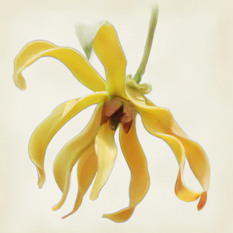

# YlangYlang

I just picked a silly project name for now while I try to think of a better one.

## What it is

This is my attempt at building a parser and compiler (of sorts) for a programming language. My priority at the moment is to build a parser and compiler with maybe some cool type-level features. It's not about language design in general, so I'm starting with a lexer and parser for Elm first. Elm is a really well designed language, and it's also the language that I'm most familiar with at the moment from my day job. 

The idea is for me to gradually add some cool features on top of the base language, which may or may not entail some syntax changes from base Elm. We'll see as we go.
